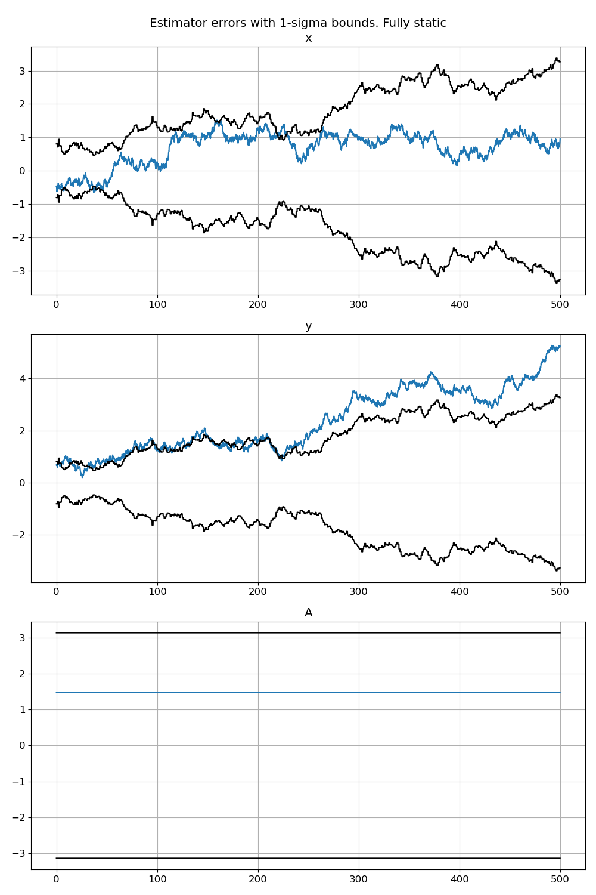
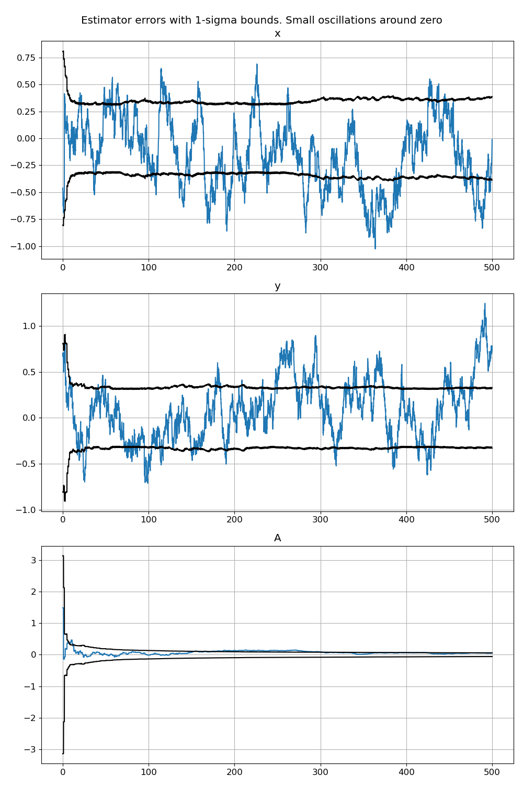
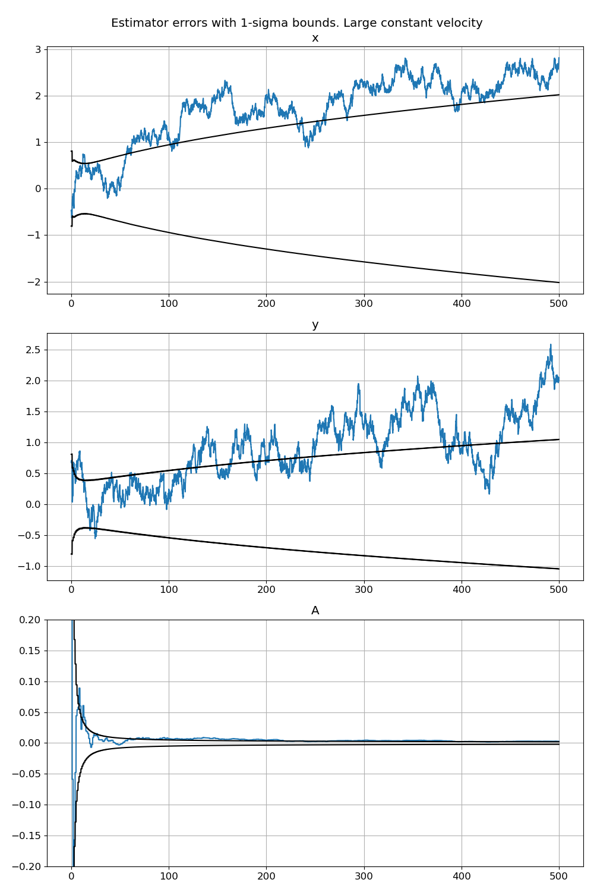

In this post I propose a novel filter applicable to problems of a certain kind which I call "azimuth alignment".
By this I mean problems where some dynamic quantities are computed and measured in two different frames rotated by unknown azimuth angle.
One practical example could be the problem of initial heading determination of inertial navigation system.
We can implement INS integration in a local frame with unknown azimuth relative to NED frame and try to estimate it by matching computed position or velocity with GNSS measurements.
I believe there exists no standard and fully satisfactory approach to solve such problems.
The possible approaches are:

- for small or moderate azimuth errors standard linearized Gaussian filter like EKF or UKF can be used
- ad-hoc extensions to Gaussian filters based on overparameterization of the azimuth angle by its sine and cosine
- particle filter or bank of filters
- optimization or "one-shot" based approaches

All of these approaches have different disadvantages, which lie either in math, applicability or implementation and utility.
Here I propose an exact and finite state filter based on conditional probability density decomposition ("Rao-Blackwellization") with von Mises distribution for azimuth angle.

# Problem formulation

I consider the simplest possible system which captures the essence of the problem.
A platform is moving on a plane with its velocity measured in its local axes, its coordinates are measured in the world frame axes.
The platform axes are rotated by an unknown azimuth angle relative to the world frame axes.

So let $r$ be the platform position resolved in its axes, $A$ be the azimuth angle.
The process model is then
$$
\dot{r} = v + w \\\\
\dot{A} = 0
$$
Where $v$ is a deterministic velocity signal which basically describes the motion scenario and $w$ is the noise vector.
For conceptual simplicity we will consider that actual executed velocity is noisy (as opposed to noisy measurements of velocity).
We are mostly interested in cases when the initial position is close to the origin.

The measurements have the form
$$
z = R(A) r + n
$$
Where $R(\cdot)$ is a 2D rotation matrix corresponding to an angle and $n$ is the measurement noise.

The situation when the azimuth is approximately known poses no difficulties and an approximate Gaussian filter like EKF or UKF can be used effectively.
However when the azimuth is known poorly or completely unknown it gets tricky.
We can imagine 2 extreme scenarios:

1. There is no motion, then the azimuth angle is clearly unobservable, but we can use position observations, because the azimuth angle is not needed while the platform is near the origin
2. There is a fast motion and we can quickly determine azimuth angle by matching $r$ and $z$ and then switch to a standard EKF filter

But all intermediate scenarios are difficult. 
Like if the platform is moving slowly or unsystematically around the origin.
In this case it's not obvious how we can use position measurements, which means that the velocity integration error will grow without bound. 
And when the significant motion starts we won't be able to estimate azimuth because the $r$ estimate will be too inaccurate.
Basically it's not clear how to "feed" an estimator with information during this stage, like the information is here, but we don't know how to use it.
This is not some hypothetical rare problem, it's a real challenge when trying to design a universal and robust INS initialization algorithm (for example).

# Precise probabilistic model formulation

As we are going to design probabilistic Bayesian estimator we need to fully define all random distributions.
The specification is very standard:

- process noise is normal with known isotropic PSD kernel $q^2 I$
- measurement noise is normal with known isotropic covariance matrix $\sigma_m^2 I$
- the position is initially distributed normally with known isotropic covariance $\sigma_0^2 I$
- the azimuth is totally arbitrary and has constant density over $[0, 2 \pi]$

We are going to track the conditional probability density in the decomposed form:
$$
p(r, A) = p(r | A) p(A)
$$
Starting from:
$$
p_0(r, A) = p_0(r) p_0(A) = \mathcal{N}(r; r_0, \sigma_0^2 I) \cdot \frac{1}{2 \pi}
$$

The Bayes formula application for the factors simply reads:
$$
p(A | z) = \frac{p(z | A) p(A)}{p(z)} \\\\[1em]
p(r | A, z) = \frac{p(z | r, A) p(r | A)}{p(z | A)} 
$$
There is no trick to these formulas, it's just the standard Bayes formula written for the two PDFs.

# Recursion for the probability density function

To find a recursion for the PDF we simply apply Bayes and Chapman-Kolmogorov formulas.

## Processing the first position measurement

Conditioned on $A$ the measurement model is linear (exactly what arises in linear Kalman filters) -- the measurement is a linear combination of normal random variables:
$$
p_0 (z | A) = \mathcal{N}\left(z; R(A) r_0, (\sigma_0^2 + \sigma_m^2) I\right)
$$
As $p_0(A) = \frac{1}{2 \pi}$ to determined $p(A | z)$ we need to examine the form of $p_0(z | A)$ as a function of $A$:
$$
\begin{aligned}
p_0(z | A) \propto \exp \left( - \frac{\lVert z - R(A) r_0 \rVert^2}{2 (\sigma_0^2 + \sigma_m^2)} \right) \propto \exp \left( \frac{ z^T R(A) r_0 }{\sigma^2 + \sigma_m^2} \right) = \\\\
= \exp\left(\frac{r_0 \cdot z}{\sigma_0^2 + \sigma_m^2} \cos A + \frac{r_0 \times z}{\sigma_0^2 + \sigma_m^2} \sin A\right)
\end{aligned}
$$
So we see an exponent of linear combination of $\cos A$ and $\sin A$. 
Such distribution is known as von Mises and it can be considered as some analogue to normal distribution for a circular variable.
In this derivation we will denote it as $\mathcal{M}$ and parameterize directly by the coefficients:
$$
p_0^+(A) = \mathcal{M}(A; \eta_0^+) \\\\
\eta_0^+ = \frac{1}{\sigma_0^2 + \sigma_m^2} \begin{bmatrix}
r_0 \cdot z_0 \\\\
r_0 \times z_0
\end{bmatrix}
$$
Note that the initial uniform distribution corresponds to $\eta = 0$.
It is always unimodal  and as $\eta$ increasing it becomes more and more concentrated.

A posteriori density for $r$ conditioned on $z$ and $A$ follows the Kalman update formula:
$$
p^+_0(r | A) = \mathcal{N}(r; a_0^+ + c_0^+ \cos A + s_0^+ \sin A, \sigma_0^{+2} I) \\\\
a_0^+ = (1 - k) r_0 \\\\
c_0^+ = k z_0 \\\\
s_0^+ = -k z_0^\times \\\\
\sigma_0^{+2} = (1 - k) \sigma_0^2 \\\\
k = \frac{\sigma_0^2}{\sigma_0^2 + \sigma_m^2}
$$
Where the notation $u^\times = \begin{bmatrix} -u_y & u_x\end{bmatrix}^T$ was used.
Here we see that the conditional mean is the linear combination of $\sin A$ and $\cos A$ and the conditional variance remains isotropic.

## Density propagation

As the azimuth $A$ is constant it's quite easy to understand that $p(A)$ doesn't change during propagation and $p(r | A)$ changes according to the linear transformation.
So for the transition from time $t_0$ to time $t_1 = t_0 + \Delta t$ using Euler method for velocity integration we get
$$
p_1(r | A) = \mathcal{N}\left(r; a_1 + c_1 \cos A + s_1 \sin A, \sigma_1^2 I \right) \\\\
a_1 = a_0^+ + v_0 \Delta t \\\\
c_1 = c_0^+ \\\\
s_1 = s_0^+ \\\\
\sigma_1^2 = \sigma_0^{+2} + q^2 \Delta t
$$

## Processing the second position measurement

We again write distribution of the measurement conditioned on $A$:
$$
p_1(z | A) = \mathcal{N}\left(z; R(A) (a_1 + c_1 \cos A + s_1 \sin A), (\sigma_1^2 + \sigma_m^2) I\right)
$$
And then
$$
p_1(A | z) \propto p_1(z | A) p_1(A) \propto \exp \left( \eta_{1x} \cos A + \eta_{1y} \sin A - \frac{1}{2 (\sigma_1^2 + \sigma_m^2)} \lVert z - R(A) (a_1 + c_1 \cos A + s_1 \sin A)  \rVert^2   \right) 
$$
The expression under exponent after expansion will contain a linear combination of $\cos A$, $\sin A$, $\cos^2 A$, $\sin^2 A$ and $\sin A \cos A$.
The product and the second powers are expressed as constant plus sine or cosine of double angle.
So the final functional form looks like this:
$$
p_1(A | z) \propto \exp(\eta^+_{1x} \cos A + \eta^+\_{1y}  \sin A + \nu^+\_{1x} \cos 2 A + \nu^+\_{1y} \sin 2A)
$$
This is a generalized von Mises distribution of order 2:
$$
p^+_1(A) = \mathcal{M}(A; \eta_1^+, \nu_1^+) \\\\
\eta^+_1 = \eta_1 + \frac{1}{\sigma_1^2 + \sigma^2_m} \begin{bmatrix}
a_1 \cdot z_1 - a_1 \cdot c_1 \\\\
a_1 \times z_1 - a_1 \cdot s_1
\end{bmatrix} \\\\[1em]
\nu^+_1 = \frac{1}{2 (\sigma_1^2 + \sigma^2_m)} \begin{bmatrix}
c_1 \cdot z_1 - s_1 \times z_1 - (\lVert c_1 \rVert^2 - \lVert s_1 \rVert^2) / 2 \\\\
c_1 \times z_1 + s_1 \cdot z_1 - c_1 \cdot s_1
\end{bmatrix}
$$
But let's closely examine $\nu_1^+$ elements.
After the first update and propagation we have:
$$
c_1 = k z_0 \\\\
s_1 = -k z_0^\times
$$
Basically the coefficient $s_1$ is 90 degrees rotated coefficient $c_1$ and we can write the relations:
$$
\lVert c_1 \rVert = \lVert s_1 \rVert \\\\
c_1 \cdot s_1 = 0 \\\\
c_1^\times = -s_1 \\\\
s_1^\times = c_1
$$
Considering these relations it is easy to see that:
$$
\nu_1^+ = 0
$$
So in fact the second harmonics are not excited and the distribution stays standard von Mises:
$$
p^+_1(A) = \mathcal{M}(A; \eta_1^+)
$$
We also have found out that we don't need to store coefficients $c$ and $s$ independently as they are related.

For $p(r | A)$ we execute the same linear Kalman filter update:
$$
p^+_1(r | A) = \mathcal{N}\left(r; a_1^+ + c_1^+ \cos A + s_1^+ \sin A; \sigma^{2+}_1 I \right) \\\\
a_1^+ = (1 - k) a_1 \\\\
c_1^+ = (1 - k) c_1 + k z \\\\
s_1^+ = (1 - k) s_1 - k z^\times \equiv -c_1^{+\times} \\\\
\sigma_1^{2+} = (1 - k) \sigma_1^2 \\\\
k = \frac{\sigma_1^2}{\sigma_1^2 + \sigma_m^2}
$$

## Full recursion formulation

Now it is easy to see that further propagation and measurement update steps won't change the functional form of the probability density function.
And thus we have the full filter recursion in an exact closed form for total of only 7 numbers -- $\eta, a, c, \sigma^2$.

- Probability density form
$$
p(r, A) = p(r | A) p(A) \\\\
p(A) = \mathcal{M}\left(A; \eta \right) \\\\
p(r | A) = \mathcal{N}\left(r; a + c \cos A -c^\times \sin A, \sigma^2 I \right) \\\\
$$
- Initialization
$$
\eta_0 = 0 \\\\
a_0 = r_0 \\\\
c_0 = 0 \\\\
\sigma_0^2 \text{-- given}
$$
- Measurement processing at epoch $i$
$$
\eta_i^+ = \eta_i + \frac{1}{\sigma_i^2 + \sigma_m^2} \begin{bmatrix}
a_i \cdot (z_i - c_i) \\\\
a_i \times (z_i - c_i) \\\\
\end{bmatrix} \\\\ [1em]
a_i^+ = (1 - k) a_i \\\\
c_i^+ = (1 - k) c_i + k z_i \\\\
\sigma_i^{2+} = (1 - k) \sigma_i^2 \\\\
\text{with } k = \frac{\sigma_i^2}{\sigma_i^2 + \sigma_m^2} \text{ -- Kalman gain}
$$
- State propagation from epoch $i$ to $i + 1$ with time step $\Delta t$
$$
\eta_{i + 1} = \eta_i^+ \\\\
a_{i + 1} = a_i^+ + v_i \Delta t \\\\
c_{i + 1} = c_i^+ \\\\
\sigma_{i + 1}^2 = \sigma_i^{2+} + q^2 \Delta t \\\\
$$

# Deriving point estimates from probability density functions

The computed probability density function fully characterizes our knowledge of the system.
It is still useful to provide "optimal" estimates and their expected accuracy if possible.

For angular von Mises distribution we will need its first and second circular moments --- $\mathrm{E} \cos A$, $\mathrm{E} \sin A$, $\mathrm{E} \cos 2 A$, $\mathrm{E} \sin 2 A$:
$$
\kappa = \lVert \eta \rVert \\\\ [0.5em]
\cos \mu = \frac{\eta_x}{\kappa} \\\\ [0.5em]
\sin \mu = \frac{\eta_y}{\kappa} \\\\ [0.5em]
\rho = \frac{I_1(\kappa)}{I_0(\kappa)} \\\\
C_1 \equiv \mathrm{E} \cos A = \rho \cos \mu \\\\
S_1 \equiv \mathrm{E} \sin A = \rho \sin \mu \\\\
\rho_2 = \frac{I_2(\kappa)}{I_0(\kappa)} \\\\
C_2 \equiv \mathrm{E} \cos 2 A = \rho_2 \cos 2 \mu \\\\
S_2 \equiv \mathrm{E} \sin 2 A = \rho_2 \sin 2 \mu
$$
We can report the mode and the standard deviation (can be interpreted as such when $\kappa \gtrsim 5$) as 
$$
A_m = \mathrm{atan2}(\sin \mu, \cos \mu) \\\\
\sigma_A = \sqrt{-2 \log \rho}
$$

As for $p(r)$ we can report its mean and covariance:
$$
\mathrm{E} r = a + c C_1 - c^\times S_1 \\\\
\mathrm{D} r = \sigma^2 I + \begin{bmatrix} c & -c^\times \end{bmatrix} \begin{bmatrix}
\dfrac{1 + C_2}{2} - C_1^2 & \dfrac{S_2}{2} - C_1 S_1 \\\\
\dfrac{S_2}{2} - C_1 S_1 & \dfrac{1 - C_2}{2} - S_1^2
\end{bmatrix} \begin{bmatrix} c^T \\\\ -c^{\times T} \end{bmatrix}
$$

# Simulation examples

Here we present 3 examples in different scenarios.
In all of them the following settings was used:

- Simulation time is 500 s
- Propagation period is 0.1 s
- Position measurement period is 1 s
- Initial position is at origin
- Position measurement and initial position standard deviations are 1 m
- Velocity process noise is 0.1 m/root-s

The results are represented as estimate errors and 1-sigma standard deviation bounds from the estimator.

## Fully static

Here we have $$
v = \begin{bmatrix}
0 \\\\
0
\end{bmatrix}
$$

We see that the azimuth is fully unobservable and the position errors exhibit some sort of irregular random walk (notice that sigma bounds are also erratic).
As the position drifts from zero the filter is less and less capable of using position corrections to contain the position errors.

## Small oscillations around zero

Here we have
$$
v = \begin{bmatrix}
0.5 \cos (2 \pi t / 10) \\\\
0.5 \sin (2 \pi t / 10)
\end{bmatrix}
$$
It corresponds to bounded circular motion around zero.

The azimuth is observable and as the distance from the origin remains bounded and small, the position accuracy is kept on the constant level.

## Motion with large constant velocity

Here we have
$$
v = \begin{bmatrix}
-1 \\\\ 2
\end{bmatrix}
$$

The azimuth is strongly observable, but due to unbounded growth of "lever arm" the position error can't be kept on the constant level.

We see that the estimator correctly "understands" all types of possible scenarios, which is impressive (but of course expected).

# Applicability to a wider range of problems

The algorithm was developed and demonstrated on a simple "toy" problem.
This was a deliberate decision in order to focus on the core ideas of probability density representation and inference.
I believe that with thorough understanding and careful engineering this approach (perhaps with some approximations) can be successfully applied to more complex and practical problems, including INS initial alignment.
The key components are here.
