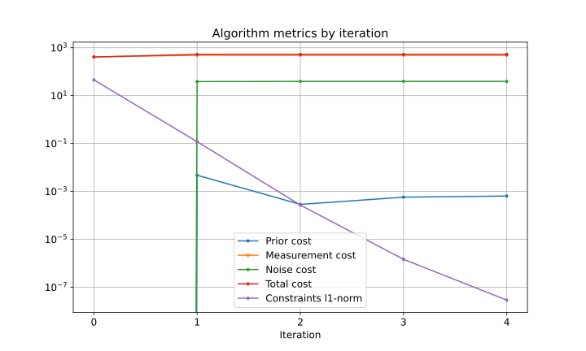
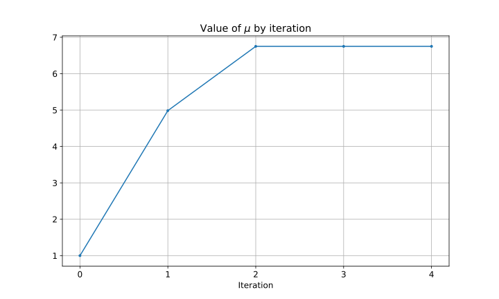
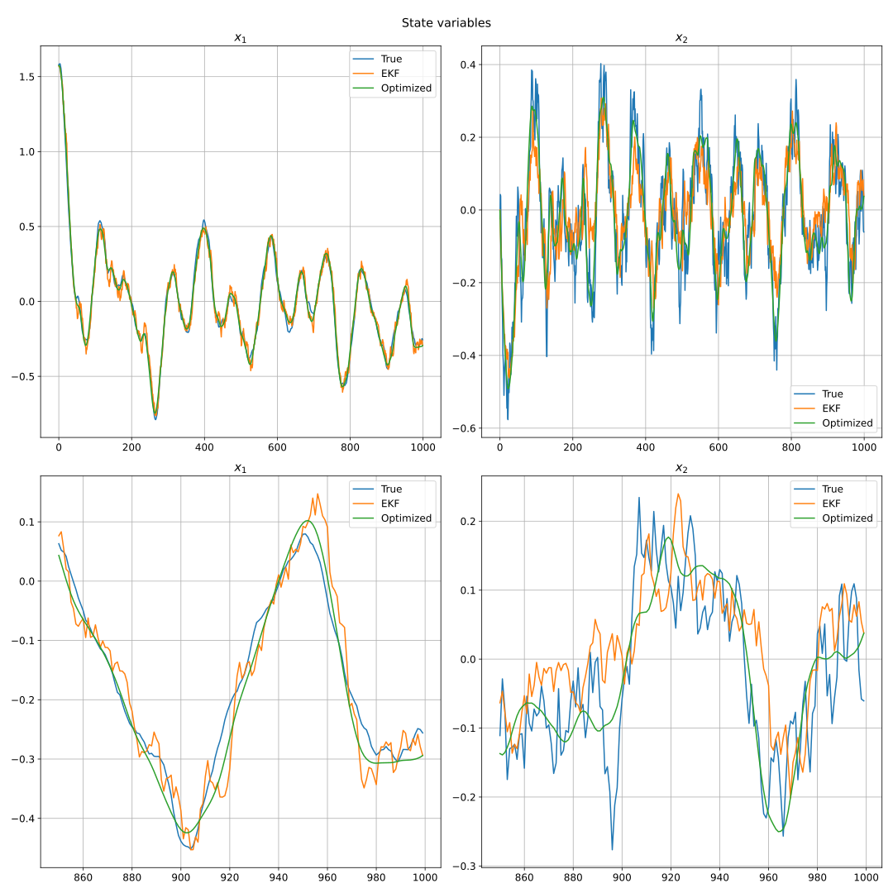
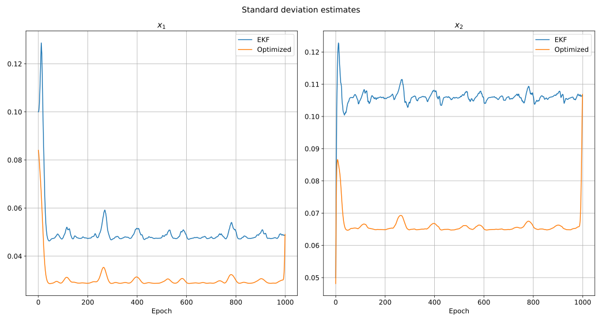

Here I want to demonstrate how the [proposed nonlinear estimation algorithm]() solves an example estimation problem.

# Model formulation

As a dynamic system for variable $y$ I consider a nonlinear damped oscillator with an external force $a$:
$$
\ddot{y} + 2 \eta \omega \dot{y} (1 + \xi \dot{y}^2) + \omega^2 \sin y = a
$$
The difference from the [linear model]() are:

* The returning force is changed from $y$ to $\sin y$ -- this can be viewed as abandoning the small angle approximation for a gravity pendulum
* The friction force now nonlinear with an additional factor of $1 + \xi \dot{y}^2$ -- the friction increases for high speed

Introducing the variables
$$
x_1 \coloneqq y \\\\
x_2 \coloneqq \dot{y} \\\\
$$
we rewrite it as a first order system
$$
\dot{x_1} = x_2 \\\\
\dot{x_2} = -\omega^2 \sin x_1 - 2 \eta \omega x_2 (1 + \xi x_2^2) + a
$$
Introduce discrete time variables 
$$
x_k \coloneqq x(k \tau) \\\\
a_k \coloneqq a(k \tau)
$$
Applying the first-order integration method we get the following discrete time equation:
$$
x_{k + 1} = f(x_k, a_k) \\\\
\text{with }f(x, a) = \begin{bmatrix}
x_1 + \tau x_2 \\\\
x_2 - \tau (\omega^2 \sin x_1 + 2 \eta \omega x_2 (1 + \xi x_2^2) + a)
\end{bmatrix}
$$
Let's introduce the noise sources into it:

* Assume that $\omega$ randomly varies from epoch to epoch, i. e. use $\omega + w_1$ in place $\omega$
* Assume that $\eta$ randomly varies from epoch to epoch, i. e. use $\eta + w_2$ in place of $\eta$
* Assume that the external force is a random white sequence, denote it by $w_3$ 

Then we have the following stochastic function
$$
f(x, w) = \begin{bmatrix}
x_1 + \tau x_2 \\\\
x_2 - \tau ((\omega + w_1)^2 \sin x_1 + 2 (\eta + w_2) (\omega + w_1) x_2 (1 + \xi x_2^2) + w_3)
\end{bmatrix}
$$
Such $f$ has nonlinearities in both state and noise which is good for evaluating the method.

Let's compute the Jacobian of $f$ with respect to $x$ and $w$:
$$
F = \frac{\partial f}{\partial x} = \begin{bmatrix}
1 & \tau \\\\
-\tau (\omega + w_1)^2 \cos x_1 & 1 - 2 \tau (\eta + w_2) (\omega + w_1) (1 + 3 \xi x_2^2) \\\\
\end{bmatrix} \\\\
G = \frac{\partial f}{\partial w} = \begin{bmatrix}
0 & 0 & 0 \\\\
-2 \tau ((\omega + w_1) \sin x_1 + (\eta + w_2) x_2 (1 + \xi x_2^2)) & -2 \tau (\omega + w_1) x_2 (1 + \xi x_2^2) & \tau
\end{bmatrix}
$$

For the measurements let's assume the following model:
$$
z = \sin x_1 + v
$$
This can be interpreted as measuring $y$ coordinate of a gravity pendulum.

Knowledge on prior statistics on $x_0$ is also available:
$$
\operatorname{E} x_0 = x_0^- \\\\
\operatorname{E} (x_0 - x_0^-)(x_0 - x_0^-)^T = P_0^-
$$

# Numerical values 

Here the numerical values used for the simulation are provided.
We assume that $x_1$ is measured in radians and $x_2$ in radians per second.

Model constants:
* $\omega = \dfrac{2 \pi}{10}$ Hz
* $\eta = 0.5$
* $\xi = 1 \text{ s}^2$ 
* $\tau = 0.1 \text{ s}$

Process noise covariance:
$$
Q = \begin{bmatrix}
(0.1 \text{ rad/s})^2 & 0 & 0 \\\\
0 & 0.01^2 & 0 \\\\
0 & 0 & (0.5 \text{ rad/s}^2)^2
\end{bmatrix}
$$
Measurement noise covariance:
$$
R = \begin{bmatrix}
(0.1 \text{ rad})^2
\end{bmatrix}
$$
Prior mean and covariance:
$$
x_0^- = \begin{bmatrix}
\pi / 2 \text{ rad} \\\\
0 \text { rad/s}
\end{bmatrix} \\\\
P_0^- = \begin{bmatrix}
(0.1 \text{ rad})^2 & 0 \\\\
0 & (0.05 \text{ rad/s})^2
\end{bmatrix}
$$

The estimation is run over 1000 epochs with [tolerance parameters]() $t_c = t_f = 10^{-8}$ for the optimization.

# Algorithm's results

Below the algorithm's metrics by iterations are shown (in log scale for y-axis).

The depicted variables have the following meaning:

* "Prior cost" -- part of the cost function which accounts for the prior statistics on $x_0$
* "Measurement cost" -- part of the cost function which accounts for the measurement residuals
* "Noise cost" -- part of the cost function which accounts for the noise magnitude
* "Total cost" -- value of the total cost function
* "Constraints l1-norm" -- l1-norm of the time transition equation residuals (summed over all epochs)

The solution at iteration 0 is the EKF solution: it has the lowest cost function (zero prior and noise costs), but doesn't at all satisfy the time transition equations.
After 1 iteration the cost function almost reaches its optimal value. 
Further iterations steadily reduce the constraints violation, which improves the solution smoothness.

In this problem 1 iteration, which corresponds to one smoother iteration (sort of <<Extended Kalman Smoother>>), gives a solution very close to the optimal and quite smooth.
But it is generally not guaranteed and the optimization 
/uj Why 1990? What breakthrough in programming style occurred that year?ntent/posts/nonlinear_batch_estimation.md#merit-function-and-line-search">}}) by iteration are depicted below

We can see that $\mu$ is increased when necessary as explained in the other post.

Below the estimated and true values of state variables are depicted.
The plots in the second row enlarges the end part of the plots in the first row.

The estimates obtained by the optimization are smooth and qualitatively more accurate that the EKF estimates.

The estimated error standard deviations are depicted below.

We observe already known from the [linear case]() relation between filter and smoother standard deviations.

Monte-Carlo simulation can and should be done to compare sample RMS and estimated SD of filter and optimization solutions.
It won't be included in this post however.

# Relation between EKF and optimized solutions

We see that EKF solution has a low value of the cost function, but neglects the constraints (state time transition equations).
As the result the estimates don't have any smoothness properties: they are perturbed by the noisy measurements and don't satisfy the time transition equations.
From the optimization perspective the EKF solution is simply infeasible, i.e. it's not considered as a proper solution to the optimization problem.

The optimization algorithm <<smooths>> the EKF solution, with each iteration reducing the residual in the state transition equations.
In the process the cost function increases (due to nonzero noise estimates), but it is necessary to satisfy the problem constraints.

# Conclusion

A solution to the batch nonlinear estimation problem as optimization was demonstrated and compared to the EKF solution.
It proved that the optimization is valid and efficient approach for solving nonlinear estimation problems.
