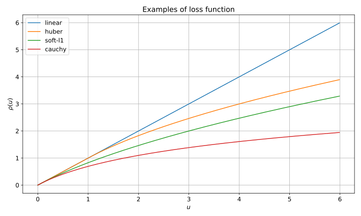

When viewed as an [optimization problem]() the Extended Kalman Filter update step can be generalized to incorporate a robust loss function in order to protect against outlier measurements.
In this note the initial theoretical development is given.

# Introducing a robust loss function

In the standard EKF update cost function the measurement residuals appear squared, which is known to be not robust against outliers.
We can alleviate this problem by wrapping the measurement residual part with a loss function $\rho$ as follows:
$$
E(X) = \frac{1}{2} (X - X^-)^T (P^-)^{-1} (X - X^-) + \frac{1}{2} \rho\left( (h(X) - Z)^T R^{-1}  (h(X) - Z) \right)
$$
The function $\rho$ must be approximately linear for small arguments (to achieve optimality of Kalman update) and sublinear for large arguments (to be robust agains outlier measurements).
Let's state its properties formally:

- $\rho(u) = u + O(u^2)$
- $\rho(u) \leq u$
- $\rho^\prime(u) > 0$
- $\rho^{\prime\prime}(u) \leq 0$

Let's consider 4 possible function as an example:

1. Trivial or linear cost function corresponding to the standard formulation -- $\rho(u) = u$.
2. Huber loss function -- $\rho(u) = \begin{cases} u & u < 1 \\\\ 2 \sqrt{u} - 1 & u \geq 1 \end{cases}$
3. "Soft-L1" loss function -- $\rho(u) = 2 (\sqrt{1 + u} - 1)$. 
   For large $u = z^2$ we get $\frac{1}{2}\rho(z^2) \approx |z|$ which corresponds to the robust L1-regression.
   To be fair, Huber loss function has the same property, but in general these names are quite arbitrary
4. Cauchy loss function -- $\rho(u) = \log(1 + u)$. 
   Such function penalties outliers significantly more heavily than the previous ones

These are depicted below:

# Adjusting the loss function by the number of measurements

There is an important subtlety that depending on the number of measurements the loss function must be adjusted.
With $m$ measurements, the random variable $(h(X) - Z)^T R^{-1}  (h(X) - Z)$ (assuming $X$ to be fixed at the optimum) has a theoretical chi-squared distribution with $m$ degrees of freedom (assuming noise to be normally distributed).
Thus it tends to be larger with more measurements and a single universal loss function is not applicable.

To tackle this issue we should consider a scaled loss function of the form
$$
\rho_s(u) = s \rho\left(\dfrac{u}{s}\right)
$$
For $m = 1$ the soft bound between inliers and outliers is 1 (1-$\sigma$ of the standard normal distribution).
For an arbitrary $m$ we require that the probability of the scaled $\chi^2_m$ variable to fall within 1 is the same:
$$
P\left(\dfrac{\chi^2_m}{s(m)} < 1 \right) = P(\chi^2_1 < 1) \\\\
P\left(\chi^2_m < s(m) \right) = P(\chi^2(1) < 1) \\\\
$$
From this we can compute the required scaling as
$$
s(m) = \mathrm{ICDF}_{\chi^2_m}(\mathrm{CDF}\_{\chi^2_1}(1))
$$
Where $\mathrm{CDF}$ and $\mathrm{ICDF}$ stand for cumulative distribution function and its inverse respectively.

Here is the list of approximate values of $s(m)$ for small $m$:
$$
s(1) = 1; s(2) = 2.3; s(3) = 3.5; s(4) = 4.7; s(5) = 5.9
$$

# Applying the loss function to individual measurements

If the measurements are independent (possibly after the decorrelation procedure) we can formulate another form of the cost function:
$$
E(X) = \frac{1}{2} (X - X^-)^T (P^-)^{-1} (X - X^-) + \frac{1}{2} \sum_j \rho \left( \left( \dfrac{h_j(X) - Z_j}{\sigma_j} \right)^2 \right)
$$

Whether the measurements should be treated independently depends on an application.
For example, GNSS position fixes  are tend to be corrupted as a whole, thus such measurements should be put under the loss function as a unit.
On the other hand, GNSS pseudo-ranges should be treated separately because they are more or less independent and rejecting all measurements is wasteflul and unreasonable.

# Handling the loss function in the optimization process

Here we consider a more general case with block measurements with an arbitrary $R$:
$$
E(X) = \frac{1}{2} (X - X^-)^T (P^-)^{-1} (X - X^-) + \frac{1}{2} \rho\left( (h(X) - Z)^T R^{-1}  (h(X) - Z) \right)
$$

The optimization is done iteratively by building quadratic function models around the current estimate.
To do that we compute the gradient and Hessian of $E$ evaluated at $X$:
$$
\nabla E(X) = -(P^-)^{-1} x^- - \rho^\prime H^T R^{-1} z \\\\
\nabla^2 E(X) = (P^-)^{-1} + H^T (\rho^\prime R^{-1} + 2 \rho^{\prime \prime} R^{-1} z z^T R^{-1}) H - \rho^\prime \sum_j (R^{-1} z)_j \nabla^2 h_j
$$
Here the following helper notation has been used:
$$
x^- = X^- - X \\\\
z = Z - h(X) \\\\
H = \dfrac{\partial h(X)}{\partial X}
$$

We apply the Gauss-Newton approximation and neglect the term with the second derivatives of $h$ in the Hessian:
$$
\nabla^2 E(X) \approx (P^-)^{-1} + H^T (\rho^\prime R^{-1} + 2 \rho^{\prime \prime} R^{-1} z z^T R^{-1}) H
$$
The quadratic subproblem to determine step $x$ is then:
$$
\min_x q(x) = \frac{1}{2} x^T \nabla^2 E(X) x + x^T \nabla E(X) + \mathrm{const}
$$
We find the minimum by setting the gradient to zero:
$$
\nabla^2 E(X) x + \nabla E(X) = 0
$$
Substituting expressions for $\nabla E(X)$ and $\nabla^2 E(X)$ we get the equation:
$$
\left( (P^-)^{-1} + H^T (\rho^\prime R^{-1} + 2 \rho^{\prime \prime} R^{-1} z z^T R^{-1}) H \right) x = (P^-)^{-1} x^- + \rho^\prime H^T R^{-1} z
$$

For $\rho(u) = u$ it is simplified to the standard linear Kalman update step:
$$
\left( (P^-)^{-1} + H^T R^{-1} H \right) x = (P^-)^{-1} x^- + H^T R^{-1} z
$$
Now we want to achieve the same form for an arbitrary loss function $\rho(u)$.

## Transformation to the standard Kalman form

For simplicity let's assume that $R = I$, which can be achieved by transforming $Z$ and $h$ by Cholesky factors of $R$ (shown at the end).
Consider the block:
$$
H^T (\rho^\prime I + 2 \rho^{\prime \prime} z z^T ) H = \rho^\prime H^T \left(I + \frac{2 \rho^{\prime \prime}}{\rho^\prime} z z^T \right) H
$$
Note that $\rho^\prime > 0$ and the division is valid.

We want to write it as $H_S^T H_S$ with $H_S = S H$. 
The matrix $S$ must satisfy then
$$
S^T S = \rho^\prime \left(I + \frac{2 \rho^{\prime \prime}}{\rho^\prime} z z^T \right)
$$
It is searched in the following form:
$$
S = \sqrt{\rho^\prime} \left(I - \alpha \dfrac{z z^T}{\lVert z \rVert^2} \right)
$$
And after the substitution we get the following equation for $\alpha$:
$$
-\dfrac{2 \alpha}{\lVert z \rVert^2} + \dfrac{\alpha^2}{\lVert z \rVert^2} = \dfrac{2 \rho^{\prime \prime}}{\rho^\prime} \\\\ [2pt]
\alpha^2 - 2 \alpha - \frac{2 \rho^{\prime \prime} \lVert z \rVert^2}{\rho^\prime} = 0
$$
A numerically stable way to find the smallest root of this quadratic equation is as follows:
$$
\alpha = - \dfrac{2 \rho^{\prime \prime} \lVert z \rVert^2 / \rho^\prime}{1 + \sqrt{1 + 2 \rho^{\prime \prime} \lVert z \rVert^2 / \rho^\prime}}
$$
To avoid taking the square root of a negative number and bound $\alpha$ below 1 (to prevent scaling by zero) a guarded formula with a small value of $\epsilon$ is used:
$$
\beta = \max \left(2 \rho^{\prime \prime} \lVert z \rVert^2 / \rho^\prime, -1 + \epsilon^2 \right) \\\\
\alpha = -\frac{\beta}{1 + \sqrt{1 + \beta}} 
$$
Then $\alpha$ will satisfy
$$
0 \leq \alpha \leq 1 - \epsilon
$$

Next we need to scale the residual vector $z$ as $z_s = \gamma z$ to satisfy:
$$
H_s^T z_s = \rho^\prime H^T z \\\\
\gamma H^T S z = \rho^\prime H^T z
$$
From which we can find
$$
\gamma = \frac{\sqrt{\rho^\prime}}{1 - \alpha}
$$

## Summary of the result

We came up with the following result. The equation
$$
\left( (P^-)^{-1} + H^T (\rho^\prime R^{-1} + 2 \rho^{\prime \prime} R^{-1} z z^T R^{-1}) H \right) x = (P^-)^{-1} x^- + \rho^\prime H^T R^{-1} z
$$
can be written as
$$
\left( (P^-)^{-1} + H_s^T H_s \right) x = (P^-)^{-1} x^- + H_s^T z_s
$$
Where the scaled observation matrix and the residual vector are computed as
$$
H_s = \sqrt{\rho^\prime} \left(I - \alpha \dfrac{z_n z_n^T}{\lVert z_n \rVert^2} \right) H_n \\\\
z_s = \frac{\sqrt{\rho^\prime}}{1 - \alpha} z_n \\\\ [2pt]
H_n = L^{-1} H \\\\
z_n = L^{-1} z
$$
Where $L$ is a Cholesky factor of $R$:
$$
R = L L^T 
$$
And the scalar $\alpha$ is computed by the algorithm:
$$
\beta = \max \left(2 \rho^{\prime \prime} \lVert z_n \rVert^2 / \rho^\prime, -1 + \epsilon^2 \right) \\\\
\alpha = -\frac{\beta}{1 + \sqrt{1 + \beta}} 
$$

The equation in the transformed form corresponds to the linear Kalman correction formula with $R = I$.

# Processing independent measurements

When measurements are independent, then the scaling is done for each component of $z$ and each row of $H$ independently.
The scaling formulas remain the same, only works with scalars.

# Algorithm outline

The robust Extended Kalman update step as an optimization procedure follows the same logic as described in the [previous post]().
But on each iterations the residual vector $z$ and the measurement matrix $H$ are scaled to account for a robust loss function as described above.
Because the optimization problem becomes more difficult and differs significantly from the standard EKF update, the iterations must be done with a line search step control until the convergence.
