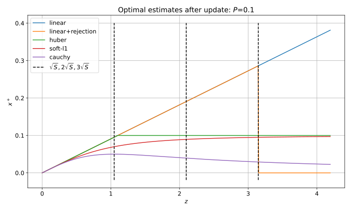
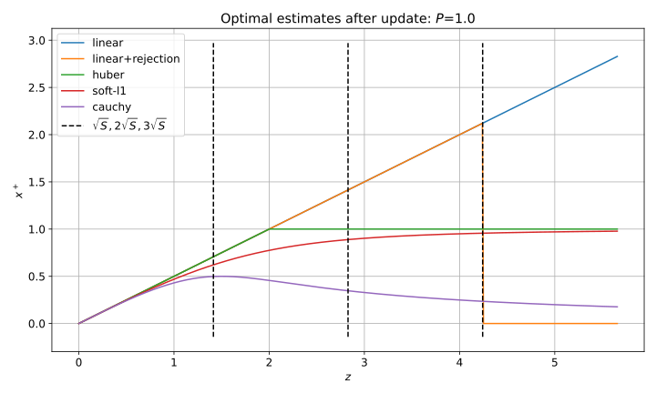
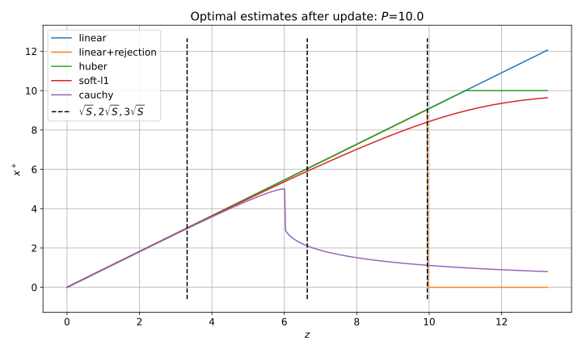

Here I compare properties of the [robust EKF update algorithm]() with a classical outlier rejection approach based on normalized innovation checks.

# Outlier rejection approach

A well known and efficient approach in Kalman filtering is analyzing whether normalized measurement innovations are reasonable.
The innovation 
$$
e = z - H x^-
$$
has theoretical covariance
$$
S = H P^- H^T + R
$$
The quadratic form $e^T S^{-1} e$ is expected to have a $\chi$-squared distribution and its excessively large values indicate a possible outlier, which should be rejected.
For scalar measurements it is equivalent to rejection measurements when the innovation is larger than (for example) 3$\sigma$ with $\sigma = \sqrt{S}$.

In the robust optimization approach the following term appears in the cost function:
$$
\rho\left((z - H x)^T R^{-1} (z - H x)\right)
$$
So here the innovations are scaled by $R$, but these are effectively "postfit" innovations, i.e. evaluated at the final solution $x^+$.
Intuitively we want to see that the decision of whether a measurement $z$ is a "soft" outlier is based on the normalized innovations $(z - H x^-)^T S^{-1} (z - H x^-)$ as well. 
However for the robust loss function approach it's not obvious at all.

It can be shown that
$$
(z - H x^-)^T S^{-1} (z - H x^-) \neq (z - H x^+)^T R^{-1} (z - H x^+)
$$
So there is no straightforward way to show the connection or equivalence.

# Analytical considerations

Let's write a robust optimization problem for a linear measurement model:
$$
\min_x \frac{1}{2} (x - x^-)^T (P^-)^{-1} (x - x^-) + \frac{1}{2} \rho \left( (z - H x)^T R^{-1} (z - H x) \right)
$$
To find the minimum we equate the gradient to zero and get the equation:
$$
(P^-)^{-1} (x^+ - x^-) = \rho^\prime H^T R^{-1} (z - H x^+)
$$
Note that $\rho^\prime$ is evaluated for the unknown $x^+$.
This "balancing" nonlinear equation can be solved to find $x^+$.
We know that the standard model has $\rho^\prime = 1$ and a robust model has $\rho^\prime < 1$ and thus the correction $x^+ - x^-$ is expected to be smaller for a robust model compared to the standard model.

To get further insides consider a scalar case:
$$
\rho(u) = \begin{cases}
u & u < 1 \\\\
2 \sqrt{u} - 1 & u \geq 1
\end{cases}
$$
For this problem we can find the solution analytically:
$$
x^+ = \begin{cases}
\dfrac{P}{S} z & z < z_* \\\\[1em]
\dfrac{P}{\sqrt{R}} & z \geq z_*
\end{cases}
$$
Where the threshold value
$$
z_* = \sqrt{1 + \frac{P}{R}} \sqrt{S}
$$
The result is quite interesting, not to say confusing:

1. Indeed we get a threshold proportional to $\sqrt{S}$, however it is additionally scaled by a factor larger than 1 which goes up as $P/R$ growths
2. For $z$ not exceeding the threshold we get the standard optimal linear solution as expected
3. For $z$ exceeding the threshold the solution stays constant 

These properties are not "bad", however it's hard to give them an intuitive interpretation, which I usually consider undesirable.

# Numerical examples

Below numerical solutions to the same simplified problem with $R = 1$ and different values of $P$ and different loss functions are shown.
The line named "linear+rejection" depicts the solution with the outlier rejection with 3$\sigma$ threshold.

The following can be noted about these plots:

1. "Soft-L1" loss works like a smoothed version of Huber loss
2. Cauchy loss works significantly different than "soft-L1" and Huber: for severe outliers the state correction goes to zero
3. Generally for all loss functions the soft rejection threshold (relative to $\sqrt{S}$) increases with $P/R$
4. Cauchy loss behaves more similarly to the classical outlier rejection approach and from an engineering standpoint perhaps looks the most appealing
5. In general a particular choice of a loss function significantly changes the behavior

# Discussion

We see that there is indeed a connection between the optimization with robust loss functions and the classical outlier rejection approach.
However this connection is not as simple and straightforward as we might've expected or hoped for.
It means that for filtering algorithms the simple rejection approach might be more preferable.
But in batch optimization, a robust loss function might be preferred to properly define the optimization problem as outlier rejection by a threshold is not differentiable.
Otherwise some ad-hoc "adjustment" algorithms will be required.
