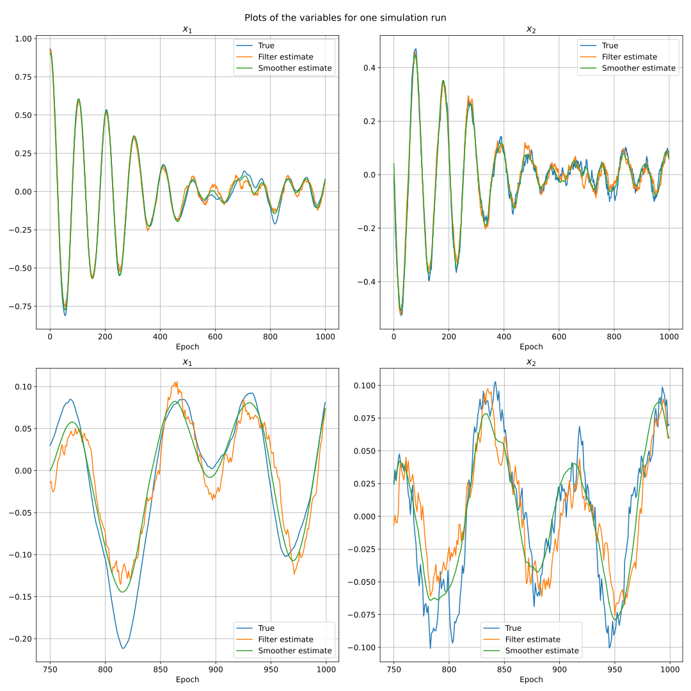
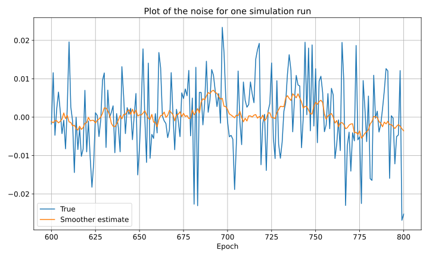
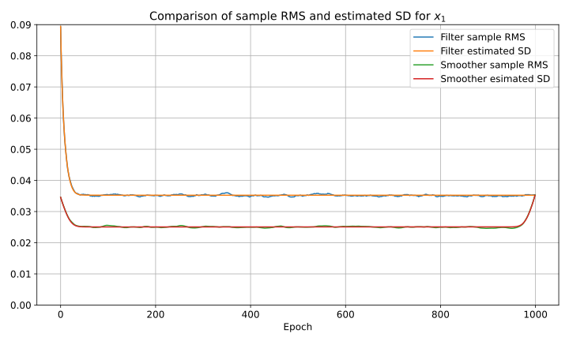
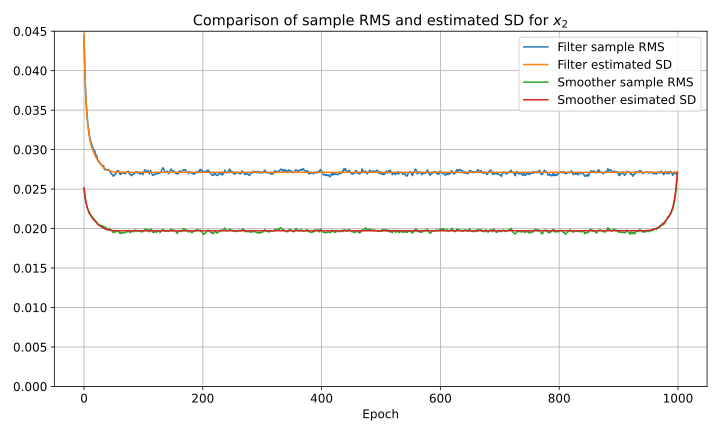
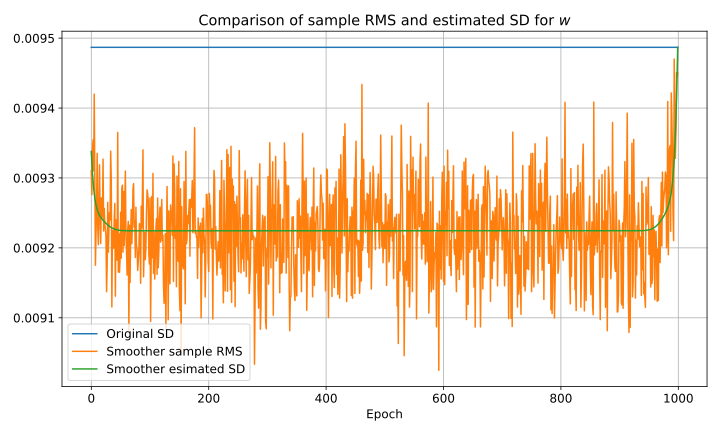

In the [previous post]() I've derived formulas for a batch state estimation <<Kalman smoother>> algorithm.
Here I want to provide a numerical verification of its correctness along with the classical Kalman filter algorithm.

# Monte Carlo method

The invaluable method of verification of estimation algorithms is Monte Carlo simulation:

1. Generate a ground truth sequence of states and measurements according to the system model. 
   It assumes generating process and measurement noises as pseudorandom numbers
2. Run the estimation algorithm and compute its estimation errors as $\Delta x_k = \hat{x}_k - x_k$, 
   where $\hat{x}_k$ and $x_k$ are the estimated and true state respectively at epoch $k$
3. Repeat steps 1 and 2 many times and compute sample mean and covariance of the errors $\Delta x_k$ for each epoch $k$

The sample mean must be close to zero and the sample covariance must match the covariance estimated by the algorithm.
Alternatively sample root mean squared errors (as $\sqrt{\operatorname{E} [\Delta x_k]_i^2}$) can be compared with standard deviations provided by the estimation algorithm.
This will check mean and covariance correctness simultaneously and this is the approach I usually use.

I will use this method to verify the Kalman filter and smoother algorithms applied to the system described in the next section.

# Model formulation

As a dynamic system I consider a damped linear oscillator which is described by the following differential equation for $y$:
$$\ddot{y} + 2 \eta \omega \dot{y} + \omega^2 y = f$$
With $\omega > 0$ being the oscillator frequency and $\eta \geq 0$ being a dimensionless damping factor and $f$ being an external force.

Introducing the variables
$$
x_1 \coloneqq y \\\\
x_2 \coloneqq \dot{y} \\\\
$$
we rewrite it as a first order system
$$
\begin{bmatrix}
\dot{x}_1 \\\\
\dot{x}_2
\end{bmatrix} = \begin{bmatrix}
0 & 1 \\\\
-\omega^2 & -2 \eta \omega
\end{bmatrix} \begin{bmatrix}
x_1 \\\\
x_2
\end{bmatrix} + \begin{bmatrix}
0 \\\\
1
\end{bmatrix} f
$$

Further we assume that $f$ is a white noise process with a known power spectral density $q_f^2$.
In this form we have a linear continuous stochastic process for $x$.
To convert it to an equivalent discrete form we use a first-order discretization scheme.
Let $\tau$ be the sampling period and 
$$
x_k \coloneqq x(k \tau)
$$
Then the discrete time system is
$$
\begin{bmatrix}
x_1 \\\\
x_2
\end{bmatrix}_{k + 1} = \begin{bmatrix}
1 & \tau \\\\
-\omega^2 \tau & 1 - 2 \eta \omega \tau 
\end{bmatrix} \begin{bmatrix}
x_1 \\\\
x_2
\end{bmatrix}_k + \begin{bmatrix}
0 \\\\ 
1
\end{bmatrix} w_k
$$
With $w_k$ being a white random sequence with the variance $q_f^2 \tau$.

Noisy measurements of $x_1$ and $x_2$ are available for each $k$ as
$$
\begin{bmatrix}
z_1 \\\\
z_2
\end{bmatrix}_k = 
\begin{bmatrix}
1 & 0 \\\\
0 & 1
\end{bmatrix} \begin{bmatrix}
x_1 \\\\
x_2 
\end{bmatrix}_k + \begin{bmatrix}
v_1 \\\\
v_2
\end{bmatrix}_k
$$

Knowledge on prior statistics on $x_0$ is also available:
$$
\operatorname{E} x_0 = x_0^- \\\\
\operatorname{E} (x_0 - x_0^-)(x_0 - x_0^-)^T = P_0^-
$$

## Model summary

We have formulated a discrete time linear stochastic model in the [standard form]().
The required matrices have the following form for our problem (they don't depend on $k$).

Prior mean:
$$
x_0^- = \begin{bmatrix}
x_{01}^- \\\\
x_{02}^-
\end{bmatrix}
$$

Prior covariance matrix:
$$
P_0^- = \begin{bmatrix}
\sigma_{01}^2 & 0 \\\\
0 & \sigma_{02}^2
\end{bmatrix}
$$

Transition matrix:
$$
F = \begin{bmatrix}
1 & \tau \\\\
-\omega^2 \tau & 1 - 2 \eta \omega \tau 
\end{bmatrix} 
$$

Process noise input matrix:
$$
G = \begin{bmatrix}
0 \\\\
1
\end{bmatrix}
$$

Process noise covariance matrix:
$$
Q = \begin{bmatrix}
q_f^2 \tau
\end{bmatrix}
$$

Measurement matrix:
$$
H = \begin{bmatrix}
1 & 0 \\\\
0 & 1
\end{bmatrix}
$$

Measurement noise covariance matrix:
$$
R = \begin{bmatrix}
\sigma^2_{z1} & 0 \\\\
0 & \sigma^2_{z2}
\end{bmatrix}
$$

## Numerical values

Here I define which numerical values will be used in the simulation.
For intuitiveness I assume that $x_1$ is measured in radians and $x_2$ in radians per second (imagine a simple gravity pendulum).
Then dimensions of the other variables follow.

$$
\omega = \frac{2 \pi}{10} \\, \text{Hz (period of 10 s)} \\\\
\eta = 0.1 \\\\
q_f = 0.03 \\, \frac{\text{rad}}{\text{s}\sqrt{\text{s}}} \\\\
\sigma_{z1} = 0.2 \\, \text{rad} \\\\
\sigma_{z2} = 0.1 \\, \frac{\text{rad}}{\text{s}} \\\\
x_{01}^- = 1 \\, \text{rad}  \\\\
x_{02}^- = 0 \\, \frac{\text{rad}}{\text{s}} \\\\
\sigma_{01}^- = 0.1 \\, \text{rad} \\\\
\sigma_{02}^- = 0.05 \\, \frac{\text{rad}}{\text{s}} \\\\
\tau = 0.1 \\, \text{s}
$$

# Simulation results

I have used 10000 runs in the simulation. 
In each run the state for 1000 epochs was computed.
For brevity and simplicity I don't analyze correlation between the states (off-diagonal elements of the covariance).

## Plots for a single simulation run

Plots of the variables for one run are depicted below.
The plots in the second row enlarges the end part of the plots in the first row.

As you can see the true state behaves somewhat erratically, especially $x_2$ as directly affected by the noise.
The same can be said for the filter estimates.
Whereas the smoother estimates are indeed significantly smoother and qualitatively more accurate (closer to the true state).

A plot for the noise during one run is depicted below.

It's hard to say for certain just by one sample, but it looks like the smoother is able to estimate some <<trends>> in the noise sequence when they occur.

## Comparison of sample RMS and estimated SD

Below plots with sample root mean squared errors (RMS) and estimated standard deviations (SD) for $x_1, x_2$ and $w$ are presented.

A plot for $w$ is done with a narrow y-axis range to demonstrate the difference between all depicted data.

We can make the following observations:

1. The agreement between sample RMS and estimated SD is very good
2. The smoother does indeed gives lower error RMS than the filter
3. The steady state smoother RMS is lower by the factor of approximately $\sqrt{2}$ compared to the filter RMS
4. The smoother performance is worse near the start and terminal epochs
5. The noise vectors are marginally observable in this model, i. e. the smoother error RMS and SD are slightly lower than the noise standard deviation

# Conclusion

Using Monte Carlo simulation I've demonstrated that Kalman filter and smoother generates estimates with statistical properties consistent with their internal covariance estimates.
It is also true for the noise estimates of the Kalman smoother, which is not well known in the estimation literature and might seem somewhat dubious at first.
